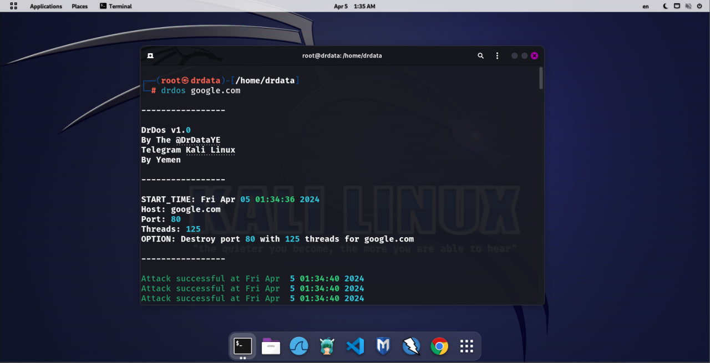

# DrDos - Klar DDos Attack Tool 🌐

DrDos is a powerful tool 🛠 designed for conducting Distributed Denial of Service (DDos) attacks 🌪, enabling users to disrupt services on specified targets effectively. It’s crafted to be simple yet effective for network testing 📡 and security assessment purposes 🔍.

## 🎉 Introduction

DrDos facilitates network administrators 🧑‍💻 and security professionals to test the resilience of networks against DDoS attacks 🛡. It allows specifying the target IP 🎯, port 🔌, and the number of threads to launch a coordinated attack, simulating real-world DDoS scenarios.

## 📥 Installation

DrDos supports both Linux 🐧 and Termux 📲 environments. You can download and install the tool easily using the following commands.

### 🐧 For Linux:

```bash
wget -O drdos.deb https://github.com/DrDataYE/DrDos/releases/latest/download/drdos.deb && sudo dpkg -i drdos.deb
```

### 📲 For Termux:

```bash
pkg install wget -y && wget https://github.com/DrDataYE/DrDos/releases/latest/download/drdos.deb && dpkg -i drdos.deb
```

These commands download the latest `.deb` package 📦 from the DrDos GitHub Releases and install it on your system.

## 🚀 Getting Started

Run DrDos using the following syntax:

```
drdos [-p PORT] [-t THREADS] [-h] [host]
```

### 📜 Command Description

- `host`: The IP address of the target server 🎯.

#### 📌 Options

- `-p PORT, --port PORT`: Specify the target port, default is 80 🚪.
- `-t THREADS, --t THREADS`: Number of threads to use in the attack, default is 125 🧵.
- `-h, --help`: Display the help menu 📚.

### 🌟 Usage Example

To attack a server with IP address `192.168.1.1` using port `80` and `125` threads:

```
drdos -p 80 -t 125 192.168.1.1
```

## ⚠️ Warning

The use of this tool can be illegal in certain circumstances and against the law in many countries. Use it responsibly and only against systems you have explicit permission to test 🚨.

## 📸 Examples

*Add screenshots or example outputs of using DrDos here to provide a visual guide for users.*



## 🤝 Compatibility

DrDos is designed to work seamlessly on both Linux 🐧 and Termux 📲, providing a versatile tool for users on different platforms.

## 📚 References

Ensure you understand the principles and risks of DDoS attacks and are aware of local laws related to penetration testing and cyber attacks before using DrDos 🔎.

## 📩 Support

For support or to report any issues, please visit the GitHub project page or contact us via Telegram.

- GitHub: [DrDataYE](https://github.com/DrDataYE)
- Telegram: [Kali Linux](https://t.me/LinuxArabe)

## 📝 Contributing

Contributions to the development and improvement of DrDos are welcome. If you wish to contribute, please submit a Pull Request on GitHub or contact us to discuss the changes you wish to make 💪.
